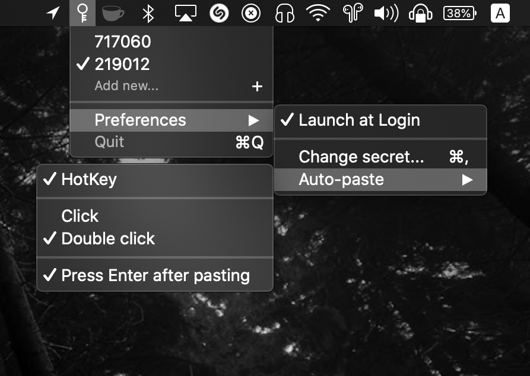

<div align="center">
  
	<h1>2FA to Tray</h1>
	<p>
		Copy <b><a href="//en.wikipedia.org/wiki/Multi-factor_authentication">2FA</a></b> tokens in a tap <sup>*</sup>
	</p>
	<br>
	<br>
	<a href="https://www.producthunt.com/posts/2fa-to-tray?utm_source=badge-featured&utm_medium=badge&utm_souce=badge-2fa-to-tray"></a>
	<br>
	<p align="right">
		<sup>*</sup> or with a <b>HotKey</b>
	</p>
</div>



### Controls

<p> &nbsp·&nbsp  &nbsp·&nbsp  &nbsp·&nbsp </p>

<p>Click the status icon or <kbd>⌥</kbd><kbd>⌘</kbd><kbd>G</kbd> &nbsp·&nbsp To copy the token</p>

<p>RMB &nbsp·&nbsp To open the menu</p>

<p>Double click &nbsp·&nbsp To change secret code or paste the token</p>

<p>Reopen (useful with Spotlight) &nbsp·&nbsp To copy the token</p>

<br>
<br>
<br>
<br>
<br>

<a href="//github.com/DaFuqtor/2FAtoTray/releases"></a>

## Install

### Via :beer: [Homebrew Cask](//brew.sh)

```powershell
brew install dafuqtor/tap/2fatotray --cask
```

### Direct Download · **[Latest Release](//github.com/DaFuqtor/2FAtoTray/releases/latest/download/2FAtoTray.zip) ([](//github.com/DaFuqtor/2FAtoTray/releases))**

*Requires macOS<sup>10.14</sup> or later.*

<br>

<h2 align="right">:mag: Usage of the menu</h2>
<p align="right"><kbd>RMB the status icon</kbd> &nbsp·&nbsp To open the menu</p>
<p align="right"><kbd>Click a token</kbd> &nbsp·&nbsp To copy it and select it for future interactions (such as HotKey or status icon click)</p>
<p align="right"><kbd>Hold your finger after a Force Touch</kbd> &nbsp·&nbsp An account that is currently under the cursor will be selected when you release your finger</p>
<p align="right">Select accounts with <kbd>CMD (⌘)</kbd>+<kbd>digit key</kbd></p>

<br>
<br>

## Features

- Automatically **sync** tokens between all your macOS devices
- HotKey: <kbd>⌥</kbd><kbd>⌘</kbd><kbd>G</kbd>
  - Can even auto-press the Return key for you
- Spotlight action
- Secure
	> 2FA to Tray uses Apple's [**Keychain Access**](//en.wikipedia.org/wiki/Keychain_(software))
- Lightweight, fast and native
- Auto-updates
	> You can still check for updates manually by clicking Preferences > Check for Updates
  - 2tT will ask you to enable auto-updates on the second launch.

<br>
<br>

## Why?

1. Authy Desktop sucks
2. Google is too busy to make an app for a system like macOS

<br>

### Contribute

> Use the [Issues](//github.com/Dafuqtor/2FAtoTray/issues) page to suggest your ideas or special needs :)
