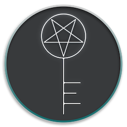

<div align="center">
  
	<h1>2FA to Tray</h1>
	<p>
		Copy <b><a target="_blank" href="//en.wikipedia.org/wiki/Multi-factor_authentication">2FA</a></b> tokens in a tap <sup>*</sup>
	</p>
	<br>
	<br>
	<br>
	<p align="right">
		<sup>*</sup> or with HotKey
	</p>
</div>

## Install

### Via :beer: [Homebrew Cask](//brew.sh)

```powershell
brew cask install dafuqtor/tap/2fatotray
```

#### Direct Download · **[Latest Release](//github.com/DaFuqtor/2FAtoTray/releases/latest/download/2FAtoTray.zip) ([](//github.com/DaFuqtor/2FAtoTray/releases))**

*Requires macOS<sup>10.14</sup> or later.*

<br>

<h2 align="right">:mag: Usage</h2>
<p align="right"><kbd>Click</kbd> &nbsp·&nbsp to copy</p>
<p align="right"><kbd>RMB</kbd> &nbsp·&nbsp to open menu</p>
<p align="right"><kbd>Double Click</kbd> &nbsp·&nbsp to change secret</p>
<p align="right"><kbd>⌘</kbd><kbd>Space</kbd> &nbsp·&nbsp type <code>2fa</code> &nbsp·&nbsp hit <kbd>Enter</kbd>&nbsp·&nbsp to copy</p>
<blockquote align="right">
	<p>(All the actions are also available in menu)</p>
</blockquote>

<br>
<br>

## Features

- Automatically **sync** tokens between all your macOS devices
- HotKey: <kbd>⌥</kbd><kbd>⌘</kbd><kbd>G</kbd>
  - Can even auto-press the Return key for you
- Secure
	> 2FA to Tray uses Apple's [**Keychain Access**](https://en.wikipedia.org/wiki/Keychain_(software))
- Lightweight, fast and native

<br>

<br>

## Why?

1. Authy Desktop sucks
2. Google is too busy to make an app for a system like macOS